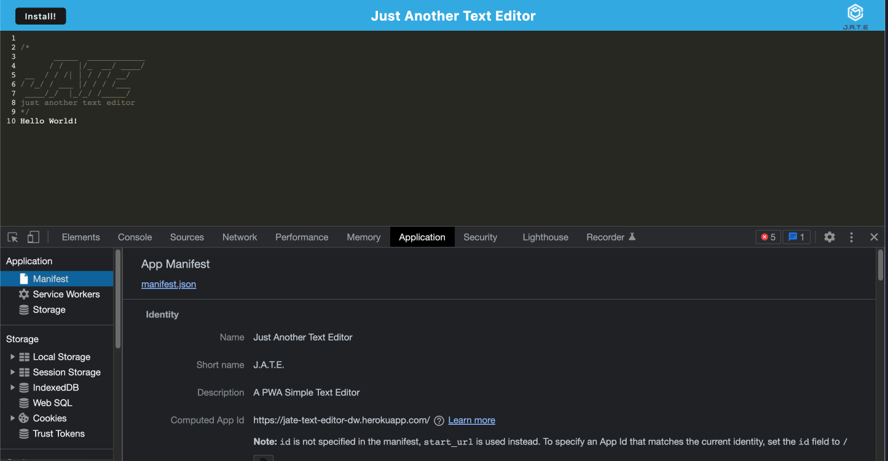

# pwa-text-editor

## Description

This project was to create a text editor that runs in the browser.  JATE is a single-page app that meets the PWA criteria.  It features data persistence techniques and offline functionality.  There is an option via the install button to have it run otuside the actual browser. 

- [Installation](#installation)
- [Usage](#usage)
- [Credits](#credits)
- [License](#license)

## Installation

The files can be used to test out the text editor.  Download and install all packages and run the app to utilize the text editor.  The full app is deployed and can be found at : https://jate-text-editor-dw.herokuapp.com/ 

## Screenshot

## Usage

The files can be viewed using any desktop browser.

## Credits

Collaborators on this project include the UPENN bootcamp cohort, teaching staff, and tutor Alexis San Javier who helped make edits to this project. Some concepts and syntax tips were learned from Colt Steele and his Udemy Bootcamp course.

## License

MIT License

Copyright (c) [2021] [Daniel Westiner]

Permission is hereby granted, free of charge, to any person obtaining a copy
of this software and associated documentation files (the "Software"), to deal
in the Software without restriction, including without limitation the rights
to use, copy, modify, merge, publish, distribute, sublicense, and/or sell
copies of the Software, and to permit persons to whom the Software is
furnished to do so, subject to the following conditions:

The above copyright notice and this permission notice shall be included in all
copies or substantial portions of the Software.

---